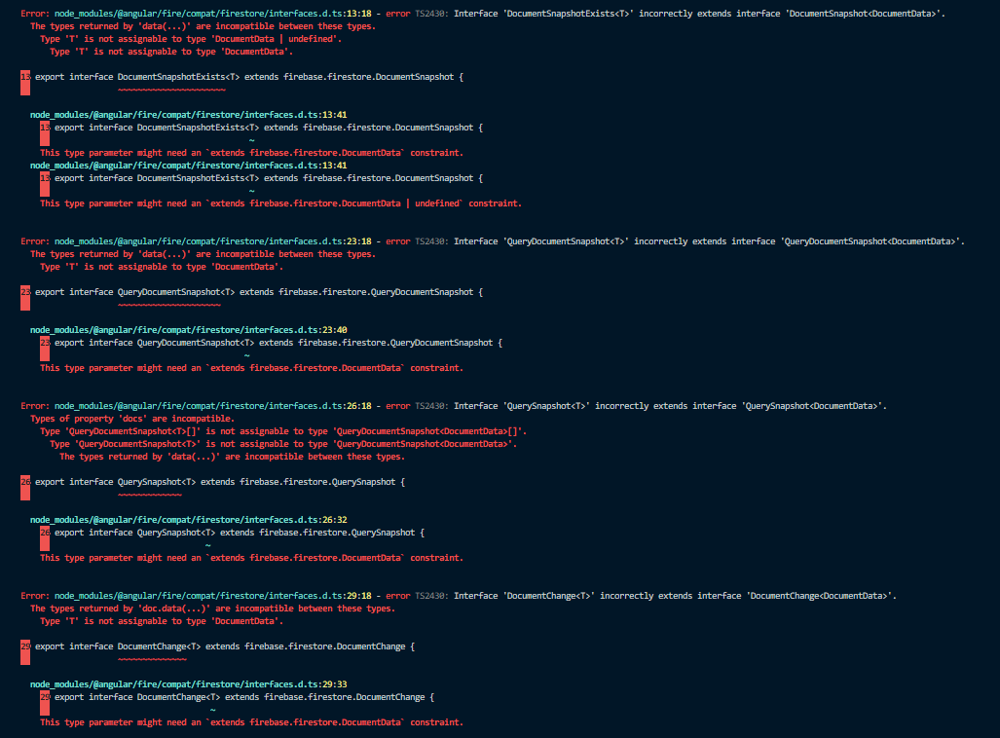
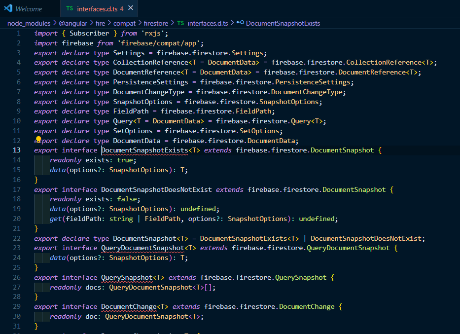
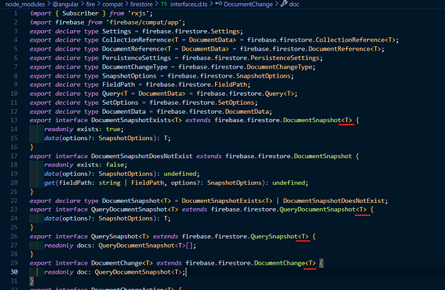

# PersonalDiary

## Устанавливаем все зависимости

`yarn install`

## Запускаем проект
`yarn run start`

### При возникновении такой ошибки

### Перейти в node_modules/@angular/fire/compat/firestore/interfaces.d.ts

### Внести следующие изменения

## Тестовые пользователи

Email: user1@gmail.com  
Пароль: ldkngniouh3474tb  

Email: user2@mail.ru  
Пароль: daslo3578  
